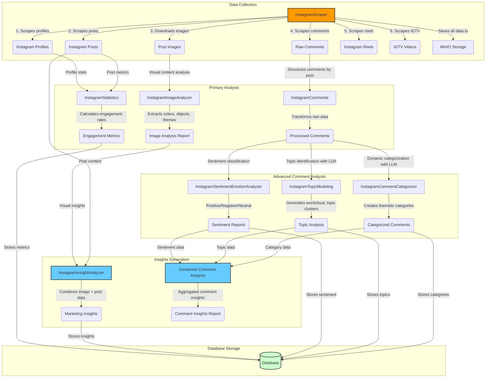

```mermaid
graph TD
    subgraph "Data Collection"
        A[InstagramScraper] -->|1. Scrapes profiles| B1(Instagram Profiles)
        A -->|2. Scrapes posts| B2(Instagram Posts)
        A -->|3. Downloads images| B3(Post Images)
        A -->|4. Scrapes comments| B4(Raw Comments)
        A -->|5. Scrapes reels| B5(Instagram Reels)
        A -->|6. Scrapes IGTV| B6(IGTV Videos)
        
        A -->|Saves all data to| C[MinIO Storage]
    end
    
    subgraph "Primary Analysis"
        B3 -->|Visual content analysis| D[InstagramImageAnalyzer]
        D -->|Extracts colors, objects, themes| D1(Image Analysis Report)
        
        B4 -->|Structures comments by post| E[InstagramComments]
        E -->|Transforms raw data| E1(Processed Comments)
        
        B1 -->|Profile stats| F[InstagramStatistics]
        B2 -->|Post metrics| F
        F -->|Calculates engagement rates| F1(Engagement Metrics)
    end
    
    subgraph "Advanced Comment Analysis"
        E1 -->|Sentiment classification| G[InstagramSentimentEmotionAnalyzer]
        G -->|Positive/Negative/Neutral| G1(Sentiment Reports)
        
        E1 -->|Topic identification with LDA| H[InstagramTopicModeling]
        H -->|Generates wordcloud, topic clusters| H1(Topic Analysis)
        
        E1 -->|Dynamic categorization with LLM| I[InstagramCommentCategorizer]
        I -->|Creates thematic categories| I1(Categorized Comments)
    end
    
    subgraph "Insights Generation"
        D1 -->|Visual insights| J[InstagramInsightAnalyzer]
        B2 -->|Post content| J
        J -->|Combines image + post data| J1(Marketing Insights)
        
        G1 -->|Sentiment data| K[Combined Comment Analysis]
        H1 -->|Topic data| K
        I1 -->|Category data| K
        K -->|Aggregated comment insights| K1(Comment Insights Report)
    end
    
    subgraph "Database Storage"
        F1 -->|Stores metrics| L[(Database)]
        J1 -->|Stores insights| L
        G1 -->|Stores sentiment| L
        H1 -->|Stores topics| L
        I1 -->|Stores categories| L
    end
    
    style A fill:#ff9900,stroke:#333,stroke-width:2px
    style J fill:#66ccff,stroke:#333,stroke-width:2px
    style K fill:#66ccff,stroke:#333,stroke-width:2px
    style L fill:#ccffcc,stroke:#333,stroke-width:2px
``` 