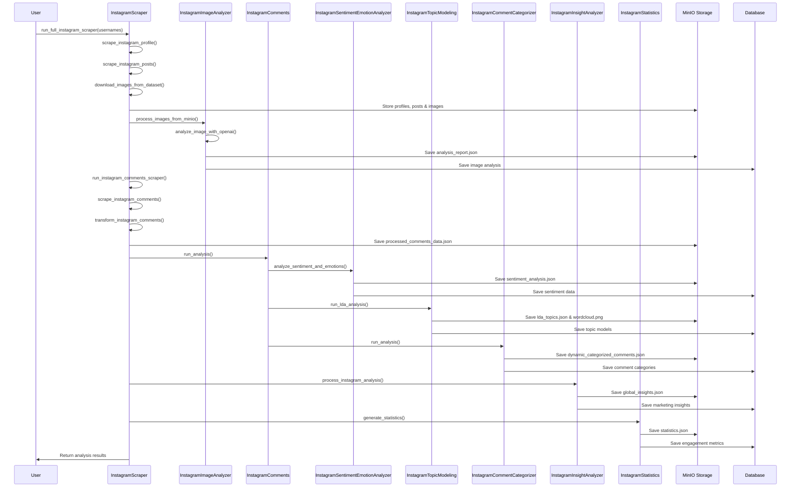

```mermaid
sequenceDiagram
    participant User
    participant Scraper as InstagramScraper
    participant Images as InstagramImageAnalyzer
    participant Comments as InstagramComments
    participant Sentiment as InstagramSentimentEmotionAnalyzer
    participant Topics as InstagramTopicModeling
    participant Categories as InstagramCommentCategorizer
    participant Insights as InstagramInsightAnalyzer
    participant Stats as InstagramStatistics
    participant Storage as MinIO Storage
    participant DB as Database
    
    User->>Scraper: run_full_instagram_scraper(usernames)
    
    %% Initial data collection
    Scraper->>Scraper: scrape_instagram_profile()
    Scraper->>Scraper: scrape_instagram_posts()
    Scraper->>Scraper: download_images_from_dataset()
    Scraper->>Storage: Store profiles, posts & images
    
    %% Image analysis branch
    Scraper->>Images: process_images_from_minio()
    Images->>Images: analyze_image_with_openai()
    Images->>Storage: Save analysis_report.json
    Images->>DB: Save image analysis
    
    %% Comments branch
    Scraper->>Scraper: run_instagram_comments_scraper()
    Scraper->>Scraper: scrape_instagram_comments()
    Scraper->>Scraper: transform_instagram_comments()
    Scraper->>Storage: Save processed_comments_data.json
    
    %% Advanced comment analysis
    Scraper->>Comments: run_analysis()
    
    Comments->>Sentiment: analyze_sentiment_and_emotions()
    Sentiment->>Storage: Save sentiment_analysis.json
    Sentiment->>DB: Save sentiment data
    
    Comments->>Topics: run_lda_analysis()
    Topics->>Storage: Save lda_topics.json & wordcloud.png
    Topics->>DB: Save topic models
    
    Comments->>Categories: run_analysis()
    Categories->>Storage: Save dynamic_categorized_comments.json
    Categories->>DB: Save comment categories
    
    %% Final insights generation
    Scraper->>Insights: process_instagram_analysis()
    Insights->>Storage: Save global_insights.json
    Insights->>DB: Save marketing insights
    
    %% Statistics generation
    Scraper->>Stats: generate_statistics()
    Stats->>Storage: Save statistics.json
    Stats->>DB: Save engagement metrics
    
    %% Complete
    Scraper->>User: Return analysis results
``` 